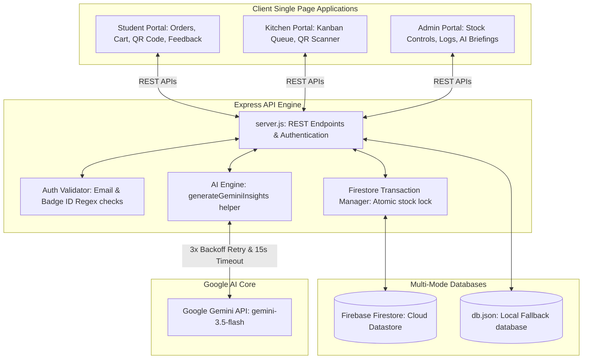

# CafeGo - Smart Mess & Canteen Pre-Ordering & Management System

CafeGo is a premium, end-to-end, high-fidelity college canteen and mess pre-ordering, queue, inventory, and AI feedback analytics platform. It is designed to modernize campus dining by streamlining order queues, tracking inventory stock with transaction safety, auditing operational logs, and leveraging Google Gemini AI to turn student feedback comments into actionable kitchen preparation guides.

---

## 🗺️ Architecture Overview

CafeGo utilizes a decoupled, multi-portal Single Page Application (SPA) architecture on the client side, backed by a Node.js Express REST API server. The database layer features a multi-mode configuration supporting cloud-hosted Firebase Firestore with transaction-safe locks, alongside a local JSON file database fallback (`db.json`) for offline development.



---

## 🌟 Core Portals & Key Features

### 1. Unified Authentication Portal (`public/index.html`)
* **Dual Login System**: Keeps the existing College ID/Badge + Password login system fully active, alongside a new optional Firebase Google Sign-In button ("Continue with Google").
* **Role-Based Logins**: Supports Students, Kitchen Staff, and Administrators.
* **Google Sign-In Email Restrictions**:
  * **Students**: Only permits whitelisted Student accounts: `lemmefind45@gmail.com`, `dranzer4545@gmail.com`, and `btechvazhaane@gmail.com`. Rejects all other Google accounts.
  * **Administrators**: Only permits whitelisted Admin account: `sooryadev.s.y@gmail.com` (which is seeded automatically in the Firestore `admins` collection). Rejects all other accounts.
  * **Kitchen Staff**: Google Sign-In is hidden for Kitchen staff; they must continue using their badge codes (`chef-[name]-YY`).
* **Visual Transitions**: Utilizes smooth custom animations and a premium SVG checkmark screen upon successful credentials validation.

### 2. Student Portal (`public/student/*`)
* **Dynamic Menu Browser**: Items are grouped by categories (Breakfast, Lunch, Snacks, Desserts, Drinks) with Veg/Non-Veg indicator tags.
* **Caloric & Nutrient Warnings**: Warns students if cart items exceed standard caloric ceilings.
* **Pickup Slot Selection**: Choice of preparation and collection slots (e.g. `12:30 - 12:45`) to optimize kitchen workflows.
* **Persistent Cart**: Automatically manages order state.
* **Timeline Tracker**: Shows live queue statuses (Pending ➔ Preparing ➔ Ready ➔ Handed Over).
* **QR Pickup Code**: Client-side QR generator converts order payload metadata into a unique barcode.
* **Interactive Feedback**: Students rate ordered items (1-5 stars) and write quality comments.

### 3. Kitchen Dashboard (`public/kitchen/*`)
* **Kanban Live Queue**: Categorizes orders into column lanes: *Pending*, *Preparing*, and *Ready*.
* **Status Controls**: Kitchen staff move orders forward with single-click actions.
* **QR Scanner Integration**: Employs the `html5-qrcode` camera-stream reader to scan student pickup QR codes, validating the payload against the server and marking orders as *Handed Over*.

### 4. Admin Management Portal (`public/admin/*`)
* **Key Metrics Panel**: Tracks gross sales, active order queues, top-rated dishes, and low-stock items.
* **Menu Editor**: Dynamic CRUD operations to create, read, update, or delete menu items.
* **Inventory Control**: Directly set stock, set low-stock thresholds, and trigger relative adjustments (add/reduce).
* **Audit Trail Logs**: View chronologically audited logs detailing every stock adjustment.
* **AI Feedback Compiler**: Compile summaries of student reviews on demand using Google Gemini.
* **Global Sales Reset**: Resets sold-today numbers for the next service cycle.

---

## 🗄️ Database Schemas (Firestore & db.json)

CafeGo maps its data into 6 primary models, supporting automated Firestore batch writes and JSON database syncs:

### 1. `college_ids`
Valid credentials for authentication.
```json
{
  "id": "CS-10245-26",
  "name": "Arjun",
  "email": "arjun@lmcst.ac.in",
  "role": "student",
  "user_id": 1,
  "password": "password123",
  "valid": true
}
```

### 2. `menu_items`
Canteen menu inventory records.
```json
{
  "name": "Harvest Grain Bowl",
  "category": "Lunch",
  "price": 150,
  "is_veg": true,
  "is_available": true,
  "image_url": "https://images.unsplash.com/photo-1546069901-ba9599a7e63c",
  "prep_time": "10m",
  "back_time": "",
  "rating": 4.9,
  "orders_count": 124,
  "stock": 20,
  "lowStockThreshold": 5,
  "soldToday": 4,
  "status": "Available",
  "lastUpdated": "2026-06-24T20:52:21.157Z"
}
```

### 3. `orders`
Dine-in and pre-order tracking.
```json
{
  "user_id": 1,
  "user_name": "Arjun",
  "total_amount": 150,
  "pickup_slot": "12:30 - 12:45",
  "status": "Pending",
  "token_number": "#SC-412",
  "items": [
    { "id": 5, "name": "Harvest Grain Bowl", "quantity": 1, "price": 150 }
  ],
  "special_instructions": "Extra dressing",
  "created_at": "2026-06-24T20:52:10.000Z",
  "qrPayload": {
    "orderId": "12",
    "tokenNumber": "#SC-412",
    "studentId": "CS-10245-26"
  },
  "pendingAt": "2026-06-24T20:52:10.000Z",
  "preparingAt": null,
  "readyAt": null,
  "handedOverAt": null
}
```

### 4. `feedback`
Review data submitted by students.
```json
{
  "user_id": 1,
  "user_name": "Arjun",
  "menu_item_id": 5,
  "menu_item_name": "Harvest Grain Bowl",
  "rating": 5,
  "comments": "The Harvest Grain Bowl was extremely fresh!",
  "created_at": "2026-06-24T20:55:00.000Z"
}
```

### 5. `ai_briefing`
Compiled AI summaries.
```json
{
  "date": "2026-06-24",
  "content": "### Daily Kitchen Briefing\n\n**1. Overall Sentiment**: Highly positive...",
  "generated_at": "2026-06-24T20:56:10.000Z",
  "status": "success",
  "model": "gemini-3.5-flash",
  "attempts": 1
}
```

### 6. `inventory_logs`
Atomically written audit records.
```json
{
  "itemId": 5,
  "itemName": "Harvest Grain Bowl",
  "action": "AUTO_DEDUCTION",
  "quantity": 1,
  "quantityChanged": -1,
  "previousStock": 21,
  "newStock": 20,
  "performedBy": "Arjun",
  "updatedBy": "Arjun",
  "timestamp": "2026-06-24T20:52:10.000Z"
}
```

### 7. `admins`
Whitelisted admin email addresses for Google Sign-In.
```json
{
  "email": "owner@gmail.com",
  "role": "admin",
  "created_at": "2026-06-24T17:00:00.000Z"
}
```

### 8. `students`
Student profiles created or updated automatically via Google Sign-In.
```json
{
  "name": "Arjun",
  "email": "arjun@lmcst.ac.in",
  "profilePhoto": "https://lh3.googleusercontent.com/...",
  "role": "student",
  "lastLogin": "2026-06-24T17:05:00.000Z"
}
```

### 9. `users`
Combined student and admin profiles synced for session retrieval and billing metrics.
```json
{
  "name": "Alex Rivera",
  "email": "owner@gmail.com",
  "profilePhoto": "https://lh3.googleusercontent.com/...",
  "role": "admin",
  "lastLogin": "2026-06-24T17:06:00.000Z"
}
```


---

## ⚡ Production-Ready Google Gemini AI Core

CafeGo integrates the `@google/generative-ai` SDK initialized with the `gemini-3.5-flash` model. The AI Insights module implements advanced features to ensure high resilience and efficient API usage:

1. **Request Timeout Protection**: All Gemini API calls are wrapped in a 15-second promise race, protecting the application from stalling during network dropouts.
2. **Automatic Retry Backoff**: If the API throws transient errors (e.g. `429 Too Many Requests` or `503 Service Unavailable`), the system automatically retries up to 3 times, exponentially increasing the wait delay:
   * **Attempt 1**: Initial call.
   * **Attempt 2**: Wait 2 seconds before calling.
   * **Attempt 3**: Wait 4 seconds before calling.
   * **Attempt 4**: Wait 8 seconds before calling.
3. **Resilient Local Fallback**: If all retry attempts are exhausted or the API key is missing, the backend triggers the local rule-based `generateLocalSummary(feedbacks)` analyzer to compile a structured summary so that the dashboard never crashes.
4. **Cache & API Optimization**: In order to save API quota, the system implements timestamp validation. `GET /api/insights/summary` compares the latest feedback's creation timestamp against the cached briefing's generation time. A new request to Gemini is only made if the cache is stale (i.e. new feedback exists) or missing.
5. **Detailed Auditing Logs**: Logs model name, start/end times, durations, retry attempts, and fallback activations to the console.

---

## 🔌 API Endpoints Reference

### 🔐 Authentication
* **`POST /api/auth/validate-id`**: Validates credentials format and checks password against the DB.
  * **Payload**: `{ "collegeId": "arjun@lmcst.ac.in", "role": "student", "password": "password123" }`
  * **Response**: `200 OK` `{ "valid": true, "user": { "role": "student", "email": "arjun@lmcst.ac.in", ... } }`
* **`POST /api/auth/google-signin`**: Verifies Google ID token from Firebase, checks role-based access list or domain, and issues session data.
  * **Payload**: `{ "idToken": "eyJhbG...", "role": "student" }`
  * **Response**: `200 OK` `{ "success": true, "user": { "collegeId": "arjun@lmcst.ac.in", "name": "Arjun", "email": "arjun@lmcst.ac.in", "role": "student", "picture": "..." } }`

### 🍔 Menu CRUD
* **`GET /api/menu`**: Retrieves the active canteen menu list.
* **`POST /api/menu`**: Creates a new menu item.
  * **Payload**: `{ "name": "Pasta", "category": "Lunch", "price": 180, "stock": 25, "lowStockThreshold": 5 }`
* **`PUT /api/menu/:id`**: Edits menu item metadata (price, categories, availability).
* **`DELETE /api/menu/:id`**: Deletes a menu item.

### 📦 Orders Queue
* **`GET /api/orders`**: Fetches all orders.
* **`POST /api/orders`**: Places a new order. Runs a Firestore Transaction to atomically validate and deduct stock, update menu stats, generate a QR payload, log changes in `inventory_logs`, and save the order.
  * **Payload**: `{ "user_id": 1, "user_name": "Arjun", "total_amount": 150, "items": [...], "pickup_slot": "12:30" }`
* **`PUT /api/orders/:id`**: Updates status (`Pending` ➔ `Preparing` ➔ `Ready` ➔ `Handed Over`). 
  * If `qrPayload` is attached, it validates the scanned ID, student ID, and token before marking the order as picked up (`Handed Over`).

### 📈 Inventory Audit
* **`GET /api/inventory/logs`**: Retrieves the last 50 inventory logs.
* **`POST /api/menu/:id/adjust-stock`**: Adjusts stock by a relative amount (positive/negative). Writes log atomically.
* **`POST /api/menu/:id/set-stock`**: Explicitly sets stock and low-stock threshold. Writes log atomically.
* **`POST /api/menu/reset-sales`**: Reset daily sales counter.

### 📝 AI Analytics
* **`GET /api/insights/summary`**: Serves clean cached insights if fresh, otherwise triggers regeneration.
* **`POST /api/insights/generate`**: Forces on-demand AI Insights compiler.
* **`GET /api/test-gemini`**: Minimal test endpoint to verify Gemini connectivity.
  * **Response**: `{ "status": "success", "model": "gemini-3.5-flash", "response": "<response text>" }`

---

## 🚀 Local Setup & Installation

### 1. Prerequisites
- [Node.js](https://nodejs.org/) (version 18 or higher)
- A [Firebase Project](https://console.firebase.google.com/) with a Cloud Firestore database.
- A [Google AI Studio API Key](https://aistudio.google.com/) for Gemini API access.

### 2. Clone & Setup
Clone the repository and install dependencies:
```bash
git clone https://github.com/sooryadev-z/canteen.git
cd canteen
npm install
```

### 3. Environment Configuration
Create a `.env` file in the root directory:
```env
PORT=3000

# Google Gemini AI Key (supports Studio Authorization Keys starting with AQ.)
GEMINI_API_KEY=AQ.Ab8RN6L8XnL...

# Firebase Web SDK Configuration
FIREBASE_API_KEY=AIzaSy...
FIREBASE_AUTH_DOMAIN=canteen-4c4a0.firebaseapp.com
FIREBASE_PROJECT_ID=canteen-4c4a0
FIREBASE_STORAGE_BUCKET=canteen-4c4a0.firebasestorage.app
FIREBASE_MESSAGING_SENDER_ID=741610584748
FIREBASE_APP_ID=1:741610584748:web:4d5dc31c76ca66613b7d09
FIREBASE_MEASUREMENT_ID=G-BR0RZQ6C71
```

### 4. Firebase Service Account Configuration (Firestore Mode)
For Admin SDK access in development, download your Firebase project service account private key JSON file, name it `serviceAccountKey.json`, and place it in the root folder of this project.

### 5. Seeding Initial Data
Seed the default users and menu items from `db.json` into your Firestore database:
```bash
node import-to-firestore.js
```

### 6. Launch the Server
Start the development server:
```bash
npm run dev
```
Open `http://localhost:3000` in your web browser.

---

## ☁️ Vercel Deployment Setup

Vercel hosts CafeGo's frontend static assets and executes `server.js` using Serverless Functions.

### 1. Configuration (`vercel.json`)
The Vercel routes are configured in [vercel.json](file:///c:/Users/devap/canteen/vercel.json) as follows:
- `/api/*` requests route to the `server.js` serverless function.
- All other routes serve static assets from the `public` directory.

### 2. Environment Variables Configuration
In your Vercel Project Settings under **Environment Variables**, configure the following:
* **`GEMINI_API_KEY`**: Your Google AI Studio key.
* **`FIREBASE_SERVICE_ACCOUNT`**: (Recommended) The complete minified JSON string of your Firebase Service Account private key file:
  ```json
  {"type":"service_account","project_id":"canteen-4c4a0",...}
  ```
* Alternatively, configure individual parameters:
  * **`FIREBASE_PROJECT_ID`**
  * **`FIREBASE_CLIENT_EMAIL`**
  * **`FIREBASE_PRIVATE_KEY`** (Ensure newlines are escaped as `\n`).

---

## 🔐 Firebase Google Sign-In Setup

To make Google Sign-In work in production or development:
1. Go to the [Firebase Console](https://console.firebase.google.com/).
2. Select your project and navigate to **Authentication**.
3. Under the **Sign-in method** tab, click **Add new provider** and select **Google**.
4. Enable the provider, select a project support email, and save.
5. In Firestore, make sure the `admins` collection contains the emails of approved administrators. The server automatically seeds the following accounts on startup (including the primary admin):
   - `owner@gmail.com`
   - `canteenadmin@gmail.com`
   - `admin@lmcst.ac.in`
   - `sooryadev.s.y@gmail.com`
6. Make sure to update your Firestore security rules (provided in `firestore.rules`) to enforce role checks.
